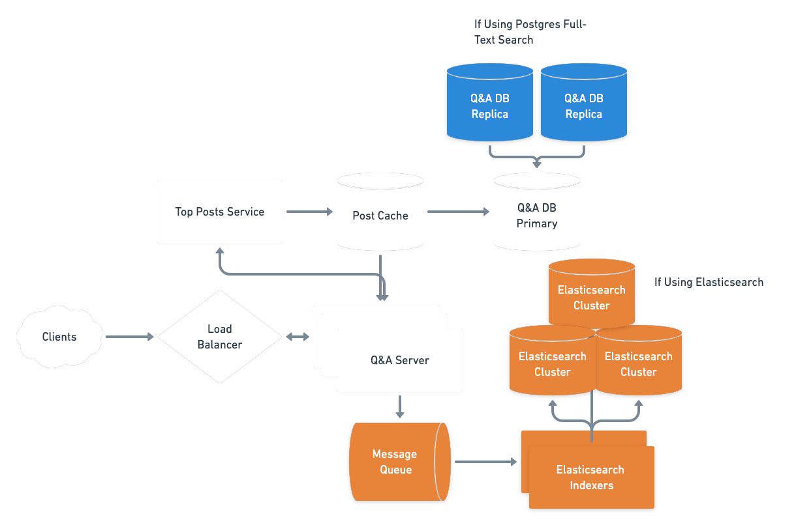

# Search functionality for a site with many articles

## Requirements
- 95% updates searchable within 10 seconds
    - After 1 day, all should be searchable
- 99% of queries return in a second
    - Return top 100 results based on
        - How well it matches
        - Votes
        - Views
        - Recency
- 10M questions/50M answers in the system
    - We're growing at about double every year
- 200M queries/month, spikey (peak 500-1000 search qps)
- Autocomplete not in scope for now
- No tracking of queries
    - But logging and metrics are always good to think about

## Estimates
### Query Load
2x10^8 queries/month * 1/3x10 months/day * 1/8.64x10^4 days/sec => 1.25x10^2 =~ 125 queries/sec
But need to support 10x that steady state for certain small periods of time (a
minute or two, say).

### Storage
We need to get a picture of how the search index grows with the number of
questions.

After running a little experiment (see below) populating a Postgres database with random
English words simulating questions and answers, the size of the GIN index is
about 5x as large as the data itself. An Elasticsearch index with default
settings over the same data was about 33% larger than this.

## High-Level Design
Read Path:
Client query hits our existing server (scale these out to handle increased
load)
This server formulates a query suitable for our search store (Postgres or ES)
The search store returns a set of results
We apply our ranking algorithm to it and return the set of results:
  -- Post id
  -- Title

Write Path:
Client submits a question or answer.
As before, we write to the database, but either now we also asynchronously
trigger a message in a data pipeline or also update the search index directly on
write if using Postgres.

The addition to our current system are colored blue (additions for Postgres) or
orange (additions for Elasticsearch) in the diagram. This will require adding DB
replicas to handle increased query load and spikey traffic and/or a message
queue on secondary search store to serve search queries.


## Can we "just use Postgres"™
Postgres does have a full-text search feature.
Advantages of this approach:
  -- Much simpler using the infrastructure we already have
  -- We don't need to change anything about our write path
    -- Because our write volume is so low, the extra time it takes to index the
    individual question or answer would not cause a bottleneck.
Disadvantages:
  -- Now our database must handle many, many more reads and store a very large
  index. Depending on our hardware, this could lead us to have to partition our
  data across replicas, greatly increasing the complexity of our infrastructure
  and application code.
  -- Much more difficult to configure than Elasticsearch which is "batteries
  included", particularly for more sophisticated natural language-style querying

### Experiment
Given the above, it made sense to try an [experiment](experiment.py) to see if we can get away
with using Postgres's full-text search. In particular, I wanted to verify that
search performance would be on par with Elasticsearch without otherwise crushing
the database.

To do so, I seeded a Postgres database with 1M posts with between 100 to 500
random words (5 to 15 words for the post title) from the English dictionary.
Then I compared the size of the table's indexes before and after indexing it for
full-text search.

```
===== BEFORE SEARCH INDEXING =====
Table size is: 436 MB
Index size is: 21 MB
===== AFTER SEARCH INDEXING =====
Table size is: 436 MB
Index size is: 2164 MB
```

Given this result, we see we'll need about 5x the existing storage to support
full-text search directly within Postgres. The equivalent Elasticsearch cluster
for the same data was over 3GB, so this roughly tracks in terms of what's needed
to support full-text search.

## Use a full-text search engine like Elasticsearch
If we were instead to turn to a dedicated search engine like Elasticsearch, we'd
have to maintain a separate data pipeline. This requires making sure we can hit our 10s SLO
Would probably want to use an async messaging pipeline, like Kafka perhaps. We
could also update both database and ES directly, but that might unacceptably
increase write latency and does not give a failsafe if the search indexing
fails. With a Kafka pipeline, we can reprocess messages later while not
impacting the synchronous write path for the client.

## Backfilling Data
Using Postgres full-text search, this is relatively easy. We may have to do this
in a rolling manner by building the index on a replica and failing over to that
replica once its finished to index the leader. This is if while indexing
performance degrades too much over a long period of time.

If using an outside search index like Elasticsearch, again we'd have to have
some backfill process, most likely using the same data pipeline as in the steady
state write path, but would potentially have to throttle this to make sure
querying all the data out does not impact service. The advantage of this
approach is that there would be no failover needed -- Elasticsearch can be
"dark" until it's ready to go.

## Ranking algorithm
Can rely on our engine to surface matches with some kind of score.
Elasticsearch, for example, gives a battle-tested score out of the box which we can then tweak
as needed.
  -- These tweaks can include boosting other aspects of the document like
  `created_at` (for recency) or `votes` for popularity.

If going with the Postgres option, we'd have to do more work on the application
level to incorporate these factors into the sorted set of search results. There
is ranking capability within Postgres, but it appears to be more complex to set
up.

## Recommendation
This all comes down to how full-featured we want our search to be. I believe
Postgres can get us a long way quite cheaply if we only need the most basic of
search functionalities.

However, if search becomes the critical way users interact with our site, and we
need to support a more sophisticated set of features, then a specially designed
solution like Elasticsearch makes more sense and justifies the additional
complexity. Further, some of that additional complexity while building the
system is offset by ease of use once in production as the API is easier to use
and there is an abundance of resources on Elasticsearch, relative to Postgres
full-text search.
