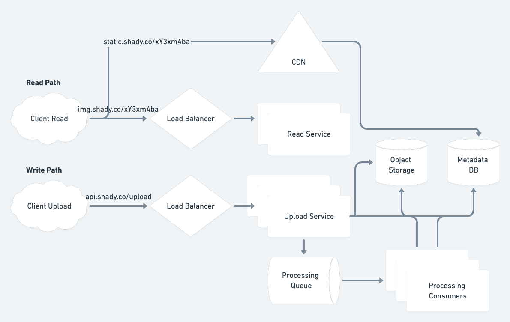

# An Image Hosting Service

## Requirements
- Users can upload any quality image, but we need to generate different sized images
    - We can decided exactly what sizes to support
- Image processing can be handled asynchronously (within a minute or two is OK)
    - Original size is available right away
- Images do not expire
- Images should be served with low latency
- Images shared by links
    - Would need to return this to the user
- Image metadata could be in scope, but not comments
- The same image by two different users could have the same link
- No need to implement rate limiting unless you have to
- 500K image uploads per day
- 5M views per day
- 30-50% user growth per year
- OK for user to wait ~10s to get their initial upload

## Estimates
### Storage
According to [this
estimate](https://www.h3xed.com/web-and-internet/statistics-and-calculations-on-how-many-images-imgur-hosts),
the average image size is 200 KB. Since we would like to store three image sizes
(small, medium and large), we can triple that to 600 KB.

5 x 10^5 images/day * 6 x 10^5 bytes/image * 3.65 x 10^2 days/year =~ 1 x 10^14 bytes/year =~ 100 TB/year

By necessity this volume of data will require a distributed object store,
something like an S3 bucket.

### Bandwidth
Upload
5 x 10^5 images/day * 6 x 10^5 bytes/image * 1/8.64 x 10^4 days/second =~ 3.5 x
10^6 bytes/second =~ 3.5 MB/s

Download
Since we have 10:1 read:write ratio, we'd expect 35 MB/s, but since we're only
viewing one image not three, this would come down to 10 MB/s

## High-Level Design


Assuming file format/length checking can be done on the client side, the
synchronous path on an image upload would be:
- Insert metadata into DB
- Send image data into blob storage
- Drop a task on the task queue for resizing
- Return the URL back to the user

This can all be done by the upload service relatively quickly. We'd want to wait
synchronously for an ack from our object store before returning the URL back to
the client as it should be live for them right away.

The read path would serve the data from our server to render the page frame and
request to the CDN (see below), for the image itself. We can detect user agent
to default to the correct image format at first, but allow a UI to select a
different size.

## Data Model/API
We need to have a metadata database that stores
```
object_id (8 bytes)
size (4 bytes)
created_at (8 bytes)
```

A relational database that stores this data will be sufficient as the amount of
data here will be relatively small enough to fit on one node (in the range of
GB/year).

We can look up the image in the object storage if we key the objects by ID and
request a certain size. This would require an index on ID and size, as we will
have multiple images potentially attached to the same size, and we will always
request a certain size

Regarding object IDs, we need to generate them and make sure they're unique and
don't collide. With 500,000 images uploaded per year, we'd end up with around 2
billion images in ten years. If our IDs used eight characters from the Base64
set, we'd have many orders of magnitude more IDs available and would be able to
avoid collisions in generating unique IDs.

## Async Image Processing
Image processing can be done by placing tasks in a message queue and having a
processing task. These can even be consumed in parallel where we have a consumer
group for each image size. These processors will insert metadata into the
database and store the resulting processed images in the object store.

## Caching and CDNs
Want to place images in a CDN for fast access. This can be a "pull" CDN that
will request data from the object store if it is not cached at the CDN yet.
