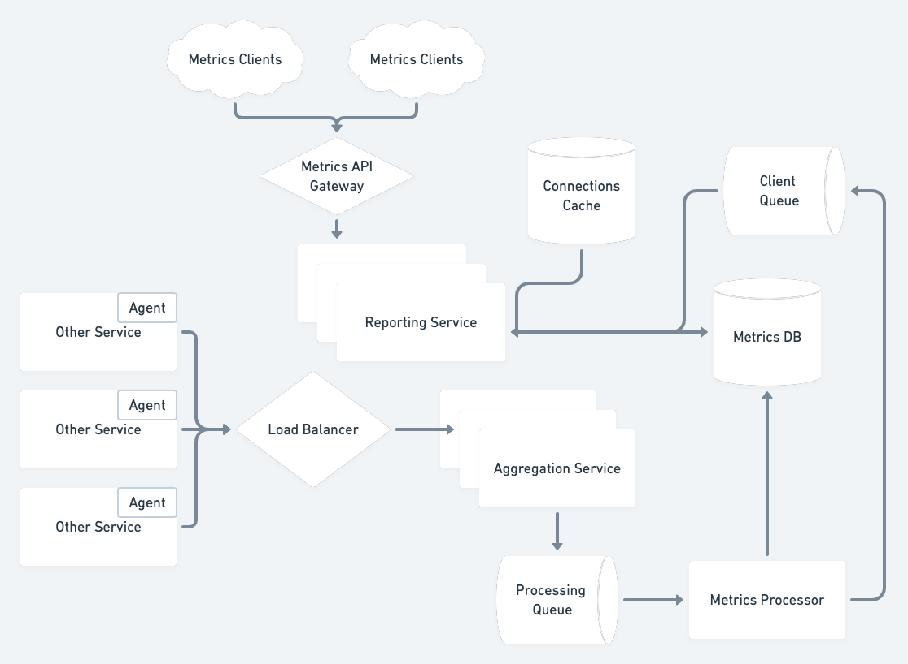

# A service that aggregates metrics across a larger system

## Requirements
- Request status/failure
- Low-level metrics on services
- Automatically collect some basic metrics
    - Allow additional custom metrics
- Granularity of one minute is OK, but a few seconds is better
- Collecting data from all the previous services so far
- Being able to create dashboards and drill down into individual machines or services
- Retention policy
    - Can be less granular over time
- Acceptable to have some data loss, but not too much (100% accuracy not
  required)
- Should be able to see recent data within a minute
- Should be highly available, but the business is not running on this so consider that
- No paging/alarms for now, but could be an extension
- Number of services will double in the next year
- Need to be able to see, e.g.:
    - Average response time of an endpoint
    - 99%ile response time of an endpoint
- Don't need to prioritize the lowest cost solution
    - Budget of a small team of engineers for one year
- Services potentially in many geographic regions

## Estimates
Suppose each "metric" contains at most 200 bytes:
```
timestamp (8 bytes)
metric_id (16 bytes)
measurement_value (8 bytes)
tags (150 bytes)
```

We will aim for a granularity of five seconds, so each service will be sending
40 bytes/s for each desired metric. Suppose across all our services we track
100,000 metrics.

Per month, this would generate:
4x10 bytes/s/metric * 8.64x10^4 s/day * 10^5 metrics * 3x10 days/month =~ 10^13
bytes/month = 10 TB/month

After one month, we can package up the data into more coarse buckets, reducing
ongoing cold storage by a factor of the bucket size (but could be on the order
of 10-100x)

## High-Level Design


Write Path:
An agent running on a specific machine calls out to our service over the network
(via gRPC), reporting the metrics as configured on the client machine.
These matrics are placed on a Kafka queue for subsequent storage in the
database.

Read Path:
Since we need to provide real-time data, we can do so with [server-sent events
(SSE)](https://developer.mozilla.org/en-US/docs/Web/API/Server-sent_events/Using_server-sent_events)
that our client can open a connection to.
The server can subscribe to a stream of events and push those to the client via
SSE, which will then handle the display logic and calculation.
The server should also be able to query the database for historical data if a
larger time window is requested.

## Database Type
Given our write volume will be particularly high, we want a database that has
very high write throughput. Also, our queries will be relatively, not relying so
much on complex joins. This points to a NoSQL store like Cassandra being a good
fit for this use case. Typical queries will be for a specific `metric_id` and
then range a of timestamps for that ID. A composite key based on the ID and the
timestamp will allows us to efficiently do these types of queries.

## Hot and Cold Storage
As data gets to be, say, a month or more older, we can have a background process
aggregate data into larger blocks to be placed in the cold storage database.
There can be several tiers of "cold" storage as needed, and we could potentially
even use a different storage engine than Cassandra, even something cheaper like
flat files in a distributed file system/S3 as the data gets very old. It could
also be deleted by that point.
