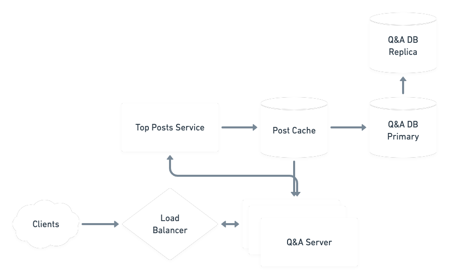

# A Question-And-Answer Website

## Requirements
Users can post questions and provide answers.
Questions and answers are up/down voted.
We display recent questions and popular questions to visitors.

## Estimates
### Query Load
We anticipate 5,000,000 questions and 20,000,000 answers contributed to the site
in the first year.

2.5 x 10^6 posts/year * 1/3.65 x 10^2 years/day * 1/8.64 x 10^4 days/second = ~.2
posts/second

We also anticipate a 100:1 read:write ratio, which would give about 20
reads/second

### Storage
If we assume 2 KB per post, then per year we would need

2 x 10^3 bytes/post * 2.5 x 10^6 posts/year = 5 x 10^9 bytes/year = 5 GB/year

## High-Level Design


## Data Model
In general I think a SQL store fits this data as well as we can leverage
transactions for updating multiple tables as well as modeling different entities
that need to fit together. One of the more significant questions here is exactly
how to model the data. In particular, how are we keeping track of votes?

### Option 1: Track votes with the question/answer itself
This is the simplest. Just increment/decrement an integer field associated with
each database row. This would simplify querying quite a bit, but is less
flexible in terms of preventing double votes/showing which user voted for what.

### Option 2: Track votes in a separate table
This has the opposite set of strengths and weaknesses as Option 1. Though we
would gain the flexibility to track individual votes and undo votes, it makes
querying much more expensive.

### Option 3: A hybrid approach
An idea that may work is to use some type of hybrid approach of both 1 and 2.
That is, track each individual vote in its own table, attached to a user and a
question, but also keep an integer field on the question itself. This is
essentially "denormalizing" the data as we now have duplication that can get out
of sync, but perhaps we can tolerate that as these vote totals being 100%
accurate are not critical to the app (unlike, say, bank balances). As long as
we're leveraging transactions we may be able to get away with this relatively
easily.

### Schema

```
Questions
question_id
title
text
author_id
created_at
updated_at
```

```
Answers
answer_id
question_id
title
text
author_id
created_at
updated_at
```

```
Votes
question_id
title
text
author_id
kind (up or down)
```

## Design Details
### Caching
Caching both the most popular and most recent questions seems like a natural fit
for this applications. This is what visitors to the site will see first and
provide the most snappy experience if we can server these quickly. Since we have
a relatively small number of posts total, it would be possible to easily keep an
entire year's worth of posts in memory on a single machine.

To support the most recent feature, we can keep a sorted set of posts in memory
and update this store upon a new question/answer. We can use some kind of sorted
in-memory data structure like a binary search tree or skip list.

To support the most popular feature, we can again keep a sorted set of posts,
but this time in the cache and update this store upon a new question/answer
upvote or downvote.

An alternative to this approach is to have a background process recalculate the
most popular/most recent posts on some regular interval (every minute or so) and
hold these in memory, which the server can then grab. This would cut down on the
number of data stores that need to kept in sync on every upvote/downvote.

These sorted sets can hold question/answer IDs, so a query requesting the home
page could access this set of IDs and pull the post data from the cache.

### Replication
Even though we are not storing an extremely large volume of data, we still want
to replicate the primary data store for fault tolerance. Write volume is
particularly low, so something like a single leader system with a synchronous
replica could be a good choice. This would provide us with read-your-own-writes
consistency and still be performant enough for the small-ish amount of writes we
are doing. Losing the primary will require failover to a replica.
