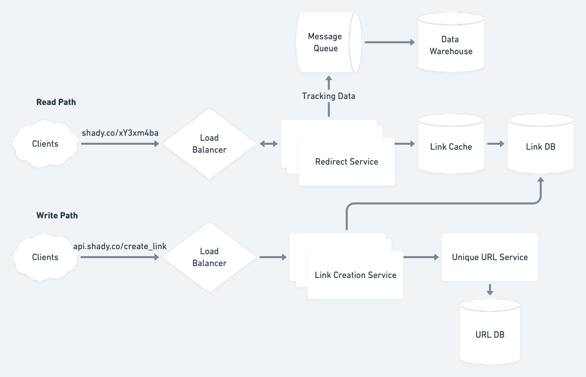

# A URL Shortener

## Requirements
### Functional
Redirect to a URL given a short URL
Shortened URLs do not have to expire
Links should be functional within 5 s of creation.
Users must be authenticated to create a shortened URL.

### Non-Functional
High availability is *extremely* important.
Low latency is also critical.
Cost is not a primary concern, but don't waste money.

## Capacity Estimates
### Requests
10^7 URLs created per day
100 clicks/URL/day

10^7 URLs/day * 8.64 x 10^-4 days/seconds = ~115 URLs/second created
10^7 URLs/day * 8.64 x 10^-4 days/seconds * 10^2 redirects/URL = ~11,000 redirects/second

Need to handle ~10,000 redirects/second

### Storage
Each redirect will result in ~200 bytes of information stored in the data
warehouse:
  * Referring Link ID (8 bytes)
  * IP Address (16 bytes -- can store v4 or v6)
  * Timestamp (8 bytes)
  * User Agent (150 bytes -- can truncate pathological cases)

Warehouse is storing
10^4 requests/second * 2x10^2 bytes/request * 8.64x10^4 seconds/day * 3.65x10^2 days/year = 6x10^13 bytes/year = 60 TB/year

The Link DB must be able to store ~100 bytes per link:
  * Link ID (8 bytes)
  * User ID (16 bytes -- assuming a UUID)
  * URL (50 bytes -- consider this an average)
  * Timestamp (8 bytes)

Link DB is storing:
10^2 requests/second * 10^2 bytes/request * 8.64x10^4 seconds/day * 3.65x10^2 days/year = 3x10^11 bytes/year = 300 GB/year

## High-Level Design


### API
The API can be extremely simple, with just create and delete operation with
fairly minimal information coming in.

```
create(user_id, url)
delete(link_id)
```

## Design Details
### Link Storage
The link database can be a key-value store which is keyed by the link id and
contains the original URL and potentially some metadata around creation time and
user who created the data.

This database will be serving all the requests, so it needs to be replicated and
fault tolerant.

With a multi-datacenter design, we can replicate data asynchronously from a
single leader that takes writes. Since we have a budget of about five seconds
before links must be active, that should give enough time from replication
across datacenters.

### Unique ID Generation
This design proposes a shortened URL ID of 8 characters.

10^7 links/day * 3.65 * 10^2 days/year * 10^2 years = 3.65 x 10^11
64^8 = (6.4 x 10)^8 = 2.8 x 10^14 will be more than enough. We can even get away
with shorter if we want to be more conservative.

We can maintain a database of pre-generated IDs and keep them in memory to
quickly server generation requests. The generation service can request a batch
of free IDs from the database, marking them as taken and holding them in memory.
With multiple servers holding these IDs in memory, we can quickly serve write
requests without contention on the database.

### Caching
In order to reduce latency, we can deploy our redirect servers to multiple
datacenters distributed around the world. We would also want a local cache in
each datacenter, which would keep hot URLs in memory. Can use an LRU eviction
policy and also give a TTL of 1 week. If we'd like to keep about a week's worth
of links in the caches, we'd need:

10^7 links/day * 7 days/week * 10^2 bytes/link = 7 x 10^9 = 7 GB, which can
easily fit in memory on the servers. The caches need not be synced across
regions, as cache misses will hit the read replicas.

### Data Warehouse
As estimated above, we are generating a fair amount of data for each redirect
that we'd like to keep track of. Because this processing can be done
asynchronously, we can spawn a thread to drop a message on a message queue (like
Kafka) in addition to serving the redirect. The data on the queue can be stored
in some distributed filesystem like HDFS. This will allow us to run some kind of
batch processing like MapReduce to produce our analytics or other data products
we can sell.
